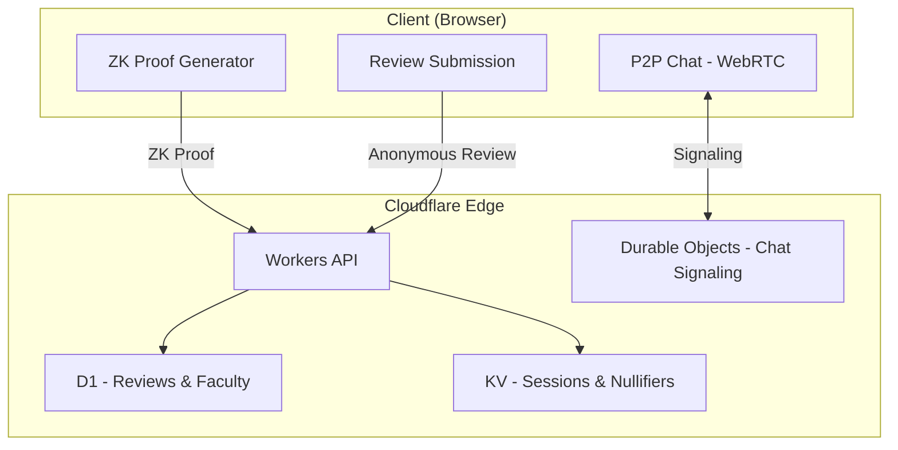
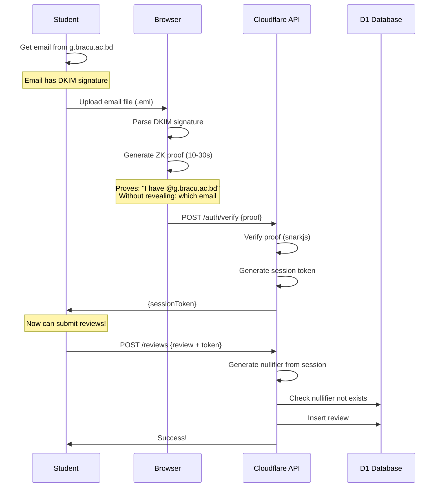

# ZK RateMyProf: Anonymous Faculty Review for BRAC University

## Overview

An anonymous faculty review platform (like RateMyProfessor) where students:
- ✅ **Prove** they have a `@g.bracu.ac.bd` email
- ✅ **Review** faculty **without revealing identity**
- ✅ **Chat** with other verified students via P2P (optional feature)

All on **Cloudflare Free Tier = $0/month**.

---

## Core Features

| Feature | Priority | Description |
|---------|----------|-------------|
| **Faculty Reviews** | 🔴 Main | Rate & review professors anonymously |
| **ZK Verification** | 🔴 Main | Prove BRACU email without revealing it |
| **Faculty Directory** | 🔴 Main | Browse courses, departments, ratings |
| **P2P Chat** | 🟡 Secondary | Discuss courses with verified students |

---

## Architecture



---

## Project Structure

```
zk-ratemyprof/
├── packages/
│   ├── api/                      # Cloudflare Workers API
│   │   ├── src/
│   │   │   ├── index.ts          # Main entry
│   │   │   ├── routes/
│   │   │   │   ├── auth.ts       # ZK proof verification
│   │   │   │   ├── faculty.ts    # Faculty CRUD
│   │   │   │   ├── reviews.ts    # Review submission
│   │   │   │   ├── courses.ts    # Course listings
│   │   │   │   └── chat.ts       # Chat signaling (WebSocket)
│   │   │   ├── durable-objects/
│   │   │   │   └── ChatRoom.ts   # P2P signaling
│   │   │   ├── lib/
│   │   │   │   ├── zk-verifier.ts
│   │   │   │   └── nullifier.ts
│   │   │   └── db/
│   │   │       └── schema.sql
│   │   └── wrangler.toml
│   │
│   ├── circuits/                 # ZK Circuits (Circom)
│   │   ├── bracu-email.circom
│   │   └── build/
│   │
│   └── frontend/                 # React Frontend
│       ├── src/
│       │   ├── pages/
│       │   │   ├── Home.tsx
│       │   │   ├── Faculty.tsx
│       │   │   ├── FacultyDetail.tsx
│       │   │   ├── SubmitReview.tsx
│       │   │   ├── Verify.tsx
│       │   │   └── Chat.tsx
│       │   ├── components/
│       │   │   ├── RatingStars.tsx
│       │   │   ├── ReviewCard.tsx
│       │   │   ├── FacultyCard.tsx
│       │   │   └── ZKProofButton.tsx
│       │   └── hooks/
│       │       ├── useZKProof.ts
│       │       └── useWebRTC.ts
│       └── package.json
│
└── package.json
```

---

## Database Schema (D1)

```sql
-- Departments
CREATE TABLE departments (
  id TEXT PRIMARY KEY,
  name TEXT NOT NULL,
  code TEXT NOT NULL  -- CSE, EEE, BBA, etc.
);

-- Faculty
CREATE TABLE faculty (
  id TEXT PRIMARY KEY,
  name TEXT NOT NULL,
  department_id TEXT REFERENCES departments(id),
  designation TEXT,  -- Professor, Lecturer, etc.
  avg_rating REAL DEFAULT 0,
  total_reviews INTEGER DEFAULT 0
);

-- Courses
CREATE TABLE courses (
  id TEXT PRIMARY KEY,
  code TEXT NOT NULL,  -- CSE110, MAT110
  name TEXT NOT NULL,
  department_id TEXT REFERENCES departments(id)
);

-- Faculty-Course mapping
CREATE TABLE faculty_courses (
  faculty_id TEXT REFERENCES faculty(id),
  course_id TEXT REFERENCES courses(id),
  PRIMARY KEY (faculty_id, course_id)
);

-- Reviews (ANONYMOUS - no user identifier!)
CREATE TABLE reviews (
  id TEXT PRIMARY KEY,
  faculty_id TEXT REFERENCES faculty(id),
  course_id TEXT REFERENCES courses(id),
  
  -- Ratings (1-5)
  rating_overall INTEGER NOT NULL,
  rating_teaching INTEGER,
  rating_grading INTEGER,
  rating_accessibility INTEGER,
  
  -- Content
  review_text TEXT,
  would_take_again BOOLEAN,
  grade_received TEXT,  -- Optional: A, B+, etc.
  
  -- Anti-spam
  nullifier TEXT UNIQUE NOT NULL,  -- Prevents duplicate reviews
  
  -- Metadata
  created_at TEXT DEFAULT CURRENT_TIMESTAMP,
  semester TEXT  -- Fall 2024, Spring 2025
);

-- Nullifier index for fast duplicate check
CREATE INDEX idx_nullifier ON reviews(nullifier);
```

---

## API Endpoints

### Authentication
```
POST /api/auth/verify
  Body: { proof, publicSignals }
  Returns: { sessionToken, expiresAt }
  
DELETE /api/auth/logout
```

### Faculty
```
GET  /api/faculty
  Query: ?department=CSE&search=john
  Returns: [{ id, name, department, avgRating, totalReviews }]

GET  /api/faculty/:id
  Returns: { faculty, courses, reviews }
```

### Reviews
```
POST /api/reviews
  Headers: Authorization: Bearer <sessionToken>
  Body: { 
    facultyId, 
    courseId, 
    ratings: { overall, teaching, grading, accessibility },
    reviewText,
    wouldTakeAgain,
    gradeReceived,
    semester
  }
  Returns: { success: true }
  
  # Nullifier auto-generated from session to prevent duplicates

GET /api/reviews?facultyId=xxx
  Returns: [{ id, ratings, reviewText, createdAt, semester }]
  # NO user identifiers returned!
```

### Courses
```
GET /api/courses
  Query: ?department=CSE
  Returns: [{ id, code, name }]
```

### Chat (Optional)
```
GET /api/chat/rooms
GET /api/chat/rooms/:id/ws  (WebSocket upgrade)
```

---

## ZK Verification Flow



---

## Anti-Spam: Nullifier System

Each student can only submit **ONE review per faculty per semester**:

```typescript
// Nullifier = hash(sessionCommitment + facultyId + semester)
const nullifier = await crypto.subtle.digest('SHA-256', 
  new TextEncoder().encode(`${sessionCommitment}:${facultyId}:${semester}`)
);
```

- ✅ Same student + same faculty + same semester = same nullifier (blocked)
- ✅ Same student + different faculty = different nullifier (allowed)
- ✅ Cannot reverse nullifier to find student identity

---

## Frontend Pages

### 1. Home Page
- Search faculty by name
- Browse by department
- Top rated professors
- Recent reviews

### 2. Faculty Detail Page
- Professor info & photo
- Average ratings breakdown
- Course list
- All reviews (paginated)
- "Write Review" button

### 3. Verify Page
- Upload email (.eml file)
- Generate ZK proof
- Get verified badge

### 4. Submit Review Page
- Select faculty & course
- Star ratings (1-5)
- Write review text
- Submit anonymously

### 5. Chat Page (Optional)
- Join course-specific chat rooms
- P2P encrypted messages

---

## Tech Stack

| Layer | Technology |
|-------|------------|
| Monorepo | Turborepo |
| API | Cloudflare Workers |
| Database | Cloudflare D1 |
| Cache/Sessions | Cloudflare KV |
| Chat Signaling | Durable Objects |
| ZK Circuits | Circom + snarkjs |
| Frontend | React + Vite |
| Styling | Tailwind CSS |
| Hosting | Cloudflare Pages |
| **Cost** | **$0/month** |

---

## Implementation Phases

### Phase 1: Setup (Week 1)
- [ ] Initialize monorepo
- [ ] Setup Cloudflare Workers + D1
- [ ] Setup React frontend
- [ ] Create database schema
- [ ] Seed with BRACU departments & sample faculty

### Phase 2: Core API (Week 2)
- [ ] Faculty CRUD endpoints
- [ ] Course endpoints
- [ ] Review submission (without ZK for now)
- [ ] Review listing & filtering

### Phase 3: ZK Integration (Week 3)
- [ ] Fork zk-email-verify
- [ ] Create bracu-email circuit
- [ ] Compile to WASM
- [ ] Auth verification endpoint
- [ ] Nullifier system

### Phase 4: Frontend (Week 4)
- [ ] Home page with search
- [ ] Faculty listing & detail pages
- [ ] ZK verification UI
- [ ] Review submission form
- [ ] Mobile responsive design

### Phase 5: Chat Feature (Week 5)
- [ ] Durable Objects for signaling
- [ ] WebRTC P2P connection
- [ ] Chat UI components
- [ ] Course-based chat rooms

### Phase 6: Polish (Week 6)
- [ ] Security audit
- [ ] Performance optimization
- [ ] SEO & meta tags
- [ ] Documentation
- [ ] Deploy to production

---

## Cloudflare Free Tier

| Service | Free Limit | Estimate | OK? |
|---------|-----------|----------|-----|
| Workers | 100K req/day | ~10K/day | ✅ |
| D1 | 5GB, 5M reads/mo | 1GB reviews | ✅ |
| KV | 100K ops/day | Sessions | ✅ |
| Durable Objects | 1M req/mo | Chat signaling | ✅ |
| Pages | Unlimited | Frontend | ✅ |

---

## Security

| Property | Implementation |
|----------|----------------|
| **Anonymity** | ZK proof reveals domain, not email |
| **Anti-spam** | Nullifiers prevent duplicate reviews |
| **No tracking** | No user IDs stored with reviews |
| **E2E Chat** | P2P WebRTC encryption |
| **Session security** | Short-lived tokens, HTTPS only |

---

## Sample Data

### Departments
- CSE - Computer Science & Engineering
- EEE - Electrical & Electronic Engineering
- BBA - Business Administration
- ENG - English
- PHY - Physics
- MAT - Mathematics

### Faculty Example
```json
{
  "id": "f_001",
  "name": "Dr. Md. Khalilur Rhaman",
  "department": "CSE",
  "designation": "Professor",
  "avgRating": 4.2,
  "totalReviews": 45
}
```

### Review Example
```json
{
  "id": "r_abc123",
  "facultyId": "f_001",
  "courseId": "cse110",
  "ratings": {
    "overall": 4,
    "teaching": 5,
    "grading": 3,
    "accessibility": 4
  },
  "reviewText": "Great lecturer, explains concepts well...",
  "wouldTakeAgain": true,
  "semester": "Fall 2024"
  // NO student identifier!
}
```

---

## Future Optimization: Rust WASM

> Start with TypeScript, optimize with Rust later if needed.

### Candidates for Rust WASM

| Component | Current (TS) | With Rust WASM | Priority |
|-----------|--------------|----------------|----------|
| **ZK Proof Verifier** | ~15ms | ~5ms | 🟡 Medium |
| **DKIM Parser** | ~10ms | ~3ms | 🟢 Low |
| **Nullifier Hashing** | ~1ms | ~0.2ms | 🟢 Low |

### When to Optimize

Trigger Rust WASM optimization if:
- ZK verification > 20ms
- API p99 latency > 100ms
- Hitting Worker CPU limits (10ms free tier)

### Rust WASM Project Structure

```
packages/
├── api/                    # TypeScript (Hono)
└── wasm/                   # Rust → WASM
    ├── Cargo.toml
    ├── src/
    │   ├── lib.rs
    │   ├── zk_verifier.rs  # groth16 verification
    │   ├── dkim_parser.rs  # Email signature parsing
    │   └── crypto.rs       # Hashing utilities
    └── pkg/                # Compiled WASM output
```

### Usage in TypeScript

```typescript
import init, { verify_proof, hash_nullifier } from '@zk-ratemyprof/wasm';

// Initialize WASM module
await init();

// Use Rust functions
const isValid = verify_proof(proof, publicSignals, verificationKey);
const nullifier = hash_nullifier(sessionId, facultyId, semester);
```

### Reference Projects

- [snarkjs-bellman](https://github.com/poma/snarkjs-bellman) - Rust ZK verifier
- [wasm-bindgen](https://github.com/nicfab/wasm-bindgen) - Rust → WASM bindings
- [workers-rs](https://github.com/nicfab/workers-rs) - Rust on Cloudflare Workers

---

## Resources

- [ZK Email SDK](https://github.com/zkemail/zk-email-verify)
- [Cloudflare D1 Docs](https://developers.cloudflare.com/d1/)
- [RateMyProfessors](https://www.ratemyprofessors.com/) (inspiration)
- [Cloudflare Workers](https://developers.cloudflare.com/workers/)
